# Basic Uniswap V2

The function used for the constant product AMM is defined as:

```Solidity
x * y = L ^ 2
```

Where:

* x = amount of token X

* y = amount of token Y

* L = liquidit

**Example:**

In this example, we see an AMM where:

* x = 200

* y = 200

* L = 200

This means the liquidity of the AMM is 200, and all combinations of token X and token Y that satisfy the function `x * y = L ^ 2` are valid.

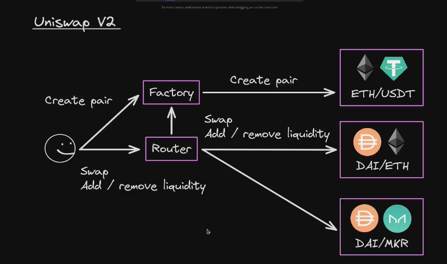


# Swap

## 📘 Uniswap V2 Swap Graph – Summary of Key Formulas

### 🔹 Invariant
- `x * y = L²`  
  The constant product rule that the pool maintains.

### 🔹 Curve Equation
- `y = L² / x`  
  The shape of the swap curve (a hyperbola).

### 🔹 Initial Price (Tangent Slope)
- `p₀ = -y₀ / x₀`  
  The instantaneous price before the trade (marginal price).

### 🔹 Swap Price (Average Execution Price)
- `p_swap = dy / dx`  
  The actual price paid during the swap.

### 🔹 Swap Equation (Preserving the Invariant)
- `(x₀ + dx)(y₀ - dy) = x₀ * y₀`  
  Ensures that the product stays constant after the swap.

### 🔹 Solving for dy
- `dy = y₀ - (x₀ * y₀) / (x₀ + dx)`  
  How much of token Y the trader receives.

### 🔹 Final Simplified Form of dy
- `dy = (y₀ * dx) / (x₀ + dx)`  
  Clean and practical formula for output amount.

### 🔹 Tangent Line Equation
- `y = p₀ * (x - x₀) + y₀`  
  Linear approximation of the curve at the initial point.

### 🔹 Swap Line Equation
- `y = p_swap * (x - x₀) + y₀`  
  Line connecting the trade input and output points.

##  Swap Math

If (x_0 + dx)(y_0 - dy) = L^2 final equation after a swap

Since both expressions equal L^2, we can say:

(x₀ + dx)(y₀ - dy) = x₀ · y₀

Divide both sides by (x₀ + dx):

y₀ - dy = (x₀ · y₀) / (x₀ + dx)

Solve for dy:

dy = y₀ - (x₀ · y₀) / (x₀ + dx)

Factor out y₀:

dy = y₀ · (1 - x₀ / (x₀ + dx))

Simplify the fraction:

dy = y₀ · (dx / (x₀ + dx))

✅ Final form:

dy = (y₀ · dx) / (x₀ + dx)

##  Swap Fee

swap fee rate is 0 < F < 1 where 1 is 100%

swap fees = Fdx

dy = (dx · (1-F) · y₀) / (x₀ + dx · (1-F))

Example:

F = 0.003
x₀ = 6_000_000
y₀ = 3000
dx = 1000

dy = (dx · (1-F) · y₀) / (x₀ + dx · (1-F))

dy = (1000 · (1-0.003) · 3000) / (6_000_000 + 1000 · (1-0.003))

dy = 0.4984171796786434

##  Swap comtract call

Basic swap contract call:

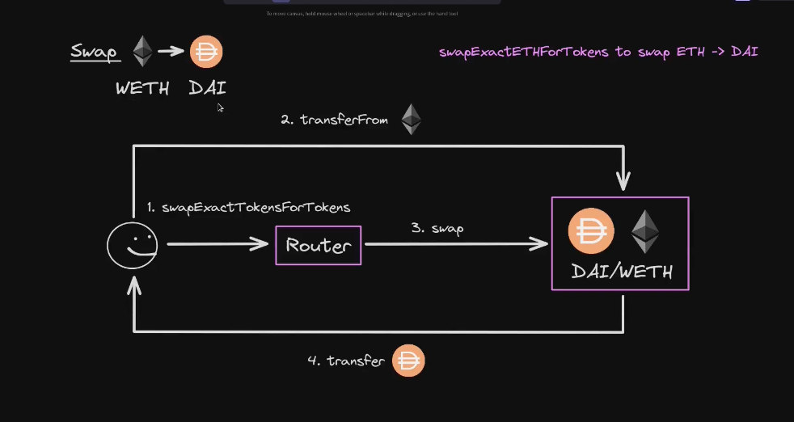

Multi-hop swap

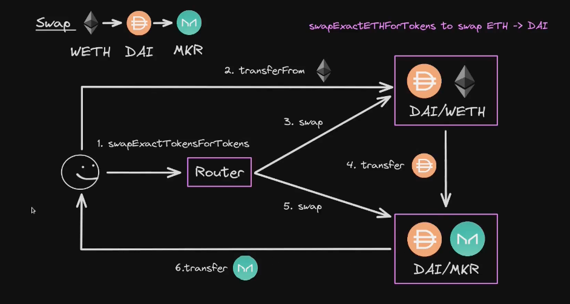

##  Swap Line tangeant and Line swap

From the graph:

`P₀` is the instantaneous price, this is the derivative of the curve at that point

`Pswap` is the effective swap price, how much of token Y you get per unit of token X. It’s not constant — it depends on the size of the trade due to slippage


	•	p₀ = -y₀ / x₀ → the initial slope, a linear approximation of the price at that point
	•	p_swap = dy / dx → the actual execution price of the trade


	•	y = p₀(x - x₀) + y₀ (orange line): linear approximation of the curve at (x₀, y₀)
	•	y = p_swap(x - x₀) + y₀ (red line): line showing the direction/price path of the actual swap

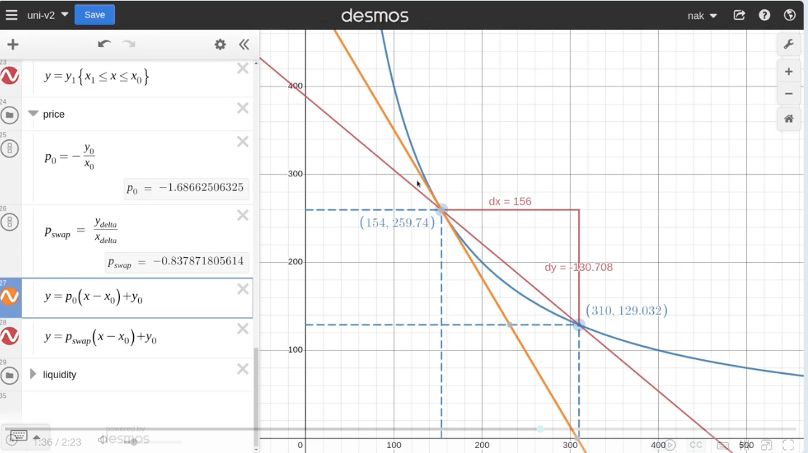

## 📘 Spot Price vs Execution Price – Summary

### 🔷 1. Constant Product Rule
- The core formula is: `x * y = k`
- This creates a curved line of valid token balances (purple line).

---

### 🔶 2. Spot Price (Instantaneous Price)
- Formula: `spot price = -y₀ / x₀`
- It’s the slope of the orange tangent line at point `(x₀, y₀)`
- Represents the current price for an infinitesimally small trade.

---

### 🟩 3. Execution Price (Real Trade)
- Formula: `execution price = -dy / dx`
- It's the slope of the green secant line from `(x₀, y₀)` to `(x₀ + dx, y₀ - dy)`
- Represents the average price over a real trade (with slippage).

---

### 🧮 4. Deriving Execution Price
Start from the swap invariant:
``(x₀ + dx)(y₀ - dy) = x₀ * y₀``

Solve for `dy`:
``dy = y₀ - (x₀ * y₀) / (x₀ + dx)``
→ Factor and simplify:
``dy = y₀ * (dx / (x₀ + dx))``

Now divide by `dx`:
``dy / dx = y₀ / (x₀ + dx)``
→ So:  
**`execution price = -dy/dx = -y₀ / (x₀ + dx)`**

---

### ✅ 5. Small Trade Behavior (dx → 0)
If `dx` is very small:
``x₀ + dx ≈ x₀``
→ Then:  
**`execution price ≈ spot price = -y₀ / x₀`**

💡 This means smaller trades suffer less slippage!


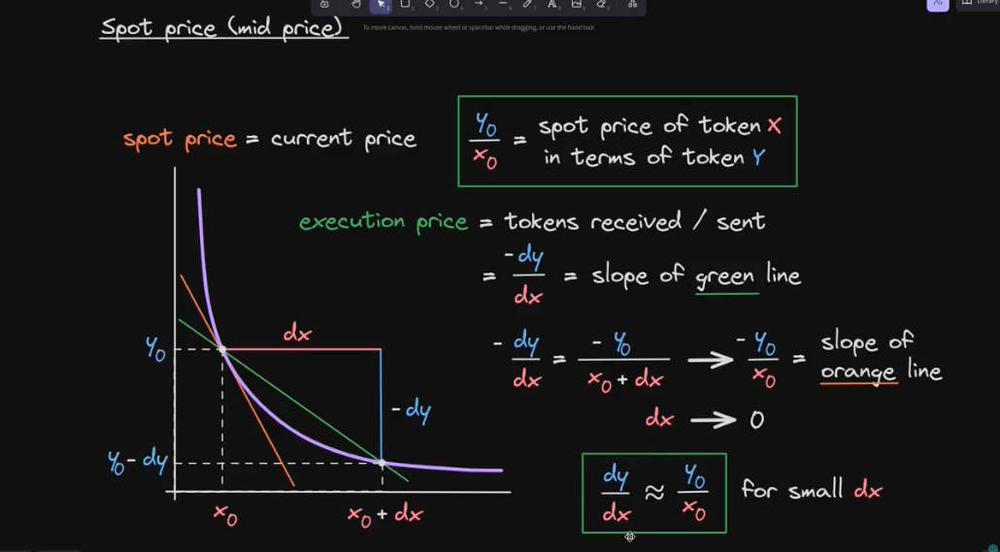


## Code Walkthrough V2-periphery

### Router

Usefull for multi-hop

https://github.com/Uniswap/uniswap-v2-periphery/contract/UniswapV2Router02.sol


#### swapExactTokensForTokens PATH

```java
    // NOTE: swap all input for max output
    // in = 1000 dai
    // out = max WETH
    function swapExactTokensForTokens(
        uint amountIn,
        uint amountOutMin,
        address[] calldata path,
        address to,
        uint deadline
    ) external virtual override ensure(deadline) returns (uint[] memory amounts) {
        // NOTE: calculates swap outputs
        // amounts[0] = input, amounts[last] = output, amounts[rest] = intermediate outputs
        amounts = UniswapV2Library.getAmountsOut(factory, amountIn, path);
        require(amounts[amounts.length - 1] >= amountOutMin, 'UniswapV2Router: INSUFFICIENT_OUTPUT_AMOUNT');

        // NOTE creat2 pair address
        // Directly send token in to pair
        TransferHelper.safeTransferFrom(
            path[0], msg.sender, UniswapV2Library.pairFor(factory, path[0], path[1]), amounts[0]
        );
        _swap(amounts, path, to);
    }
```

```java

    // **** SWAP ****
    // requires the initial amount to have already been sent to the first pair
    function _swap(uint[] memory amounts, address[] memory path, address _to) internal virtual {
        // NOTE
        //    i | path[i]   | path [i + 1]
        //    0 | path[0]   | path [1]
        //    1 | path[1]   | path [2]
        //    2 | path[2]   | path [3]
        //    3 | path[n-2]   | path [n-1]
        for (uint i; i < path.length - 1; i++) {
            (address input, address output) = (path[i], path[i + 1]);
            
            (address token0,) = UniswapV2Library.sortTokens(input, output);
            uint amountOut = amounts[i + 1];
            
            (uint amount0Out, uint amount1Out) = input == token0 ? (uint(0), amountOut) : (amountOut, uint(0));

            // NOTE: last swap -> send token out to "to" address
            // otherwise -> send to next pair contract
            address to = i < path.length - 2 ? UniswapV2Library.pairFor(factory, output, path[i + 2]) : _to;
            
            // NOTE : swap doesn't ask for amount in only amounts out
            IUniswapV2Pair(UniswapV2Library.pairFor(factory, input, output)).swap(
                amount0Out, amount1Out, to, new bytes(0)
            );
        }
    }
```

getAmountsOut

https://github.com/Uniswap/uniswap-v2-periphery/contract/libraries/UniswapV2Library.sol

```java
    // given an input amount of an asset and pair reserves, returns the maximum output amount of the other asset
    
    // NOTE : amoutns[0] = amountIN
    // amounts[n - 1] = Final aout
    // amoutns[i] = intermediate amount
    function getAmountsOut(address factory, uint amountIn, address[] memory path) internal view returns (uint[] memory amounts) {
        require(path.length >= 2, 'UniswapV2Library: INVALID_PATH');
        amounts = new uint[](path.length);
        amounts[0] = amountIn;
        // NOTE
        //    i | path[i]   | path [i + 1]
        //    0 | path[0]   | path [1]
        //    1 | path[1]   | path [2]
        //    2 | path[2]   | path [3]
        //    3 | path[n-2] | path [n-1]
        for (uint i; i < path.length - 1; i++) {
            // NOTE: reserves = internal balance of tokens inside pair contract
            (uint reserveIn, uint reserveOut) = getReserves(factory, path[i], path[i + 1]);
            // NOTE: use the previous output for input
            amounts[i + 1] = getAmountOut(amounts[i], reserveIn, reserveOut);
            // NOTE : example
            // path = [DAI, WETH]
            // amounts[0] = 1000 * 10 ** 18 DAI
            // amounts[1] = WETH amount out

            // path = [DAI, WETH, MKR]
            // amounts[0] = 1000 * 10 ** 18 DAI
            // amounts[1] = WETH amount out
            // amounts[2] = MKR amount out
        }
    }
```

calling amountOut

```java
    // given an input amount of an asset and pair reserves, returns the maximum output amount of the other asset
    function getAmountOut(uint amountIn, uint reserveIn, uint reserveOut) internal pure returns (uint amountOut) {
        require(amountIn > 0, 'UniswapV2Library: INSUFFICIENT_INPUT_AMOUNT');
        require(reserveIn > 0 && reserveOut > 0, 'UniswapV2Library: INSUFFICIENT_LIQUIDITY');
        // NOTE: 
        // x = token in
        // y = token out
        // F = 0.003
        //       dx * 0.997 * x0
        // dy = -------------
        //       d0 + dx * 0.997

        // NOTE:
        // dx * 997
        uint amountInWithFee = amountIn.mul(997);
        // dx * 997 * y0
        uint numerator = amountInWithFee.mul(reserveOut);
        // x0 * 1000 + dx * 997
        uint denominator = reserveIn.mul(1000).add(amountInWithFee);
        // dy = (dx * 997 * y0) / (x0 * 1000 + dx * 997)
        // dy = (dx * 997/1000 * y0) / (x0 + dx * 997/1000)

        amountOut = numerator / denominator;
    }
```

Check playground and UniswapV2SwapAmountsTest for simple example of getAmountOut Usage

#### swapTokensForExactTokens

```java
    // NOTE: swap min input for specified output
    // max in = 3000 DAO
    // out = 1 WETH
    function swapTokensForExactTokens(
        uint amountOut,
        uint amountInMax,
        address[] calldata path,
        address to,
        uint deadline
    ) external virtual override ensure(deadline) returns (uint[] memory amounts) {
        // NOTE calculate amount in
        amounts = UniswapV2Library.getAmountsIn(factory, amountOut, path);
        require(amounts[0] <= amountInMax, 'UniswapV2Router: EXCESSIVE_INPUT_AMOUNT');
        TransferHelper.safeTransferFrom(
            path[0], msg.sender, UniswapV2Library.pairFor(factory, path[0], path[1]), amounts[0]
        );
        _swap(amounts, path, to);
    }
```

let's check amountsIn

```java
    // performs chained getAmountIn calculations on any number of pairs
    function getAmountsIn(address factory, uint amountOut, address[] memory path) internal view returns (uint[] memory amounts) {
        require(path.length >= 2, 'UniswapV2Library: INVALID_PATH');
        amounts = new uint[](path.length);
        amounts[amounts.length - 1] = amountOut;
        // NOTE:
        //    i | output amount   | input amount
        //    n-1 | amounts[n-1]  | amounts[n-2]
        //    n-2 | amounts[n-2]  | amounts[n-3]
        // ...
        //    2 | amounts[2]      | amounts[1]
        //    1 | amounts[1]      | amounts[0]
        for (uint i = path.length - 1; i > 0; i--) {
            (uint reserveIn, uint reserveOut) = getReserves(factory, path[i - 1], path[i]);
            amounts[i - 1] = getAmountIn(amounts[i], reserveIn, reserveOut);
        }
    }
```

Details of amountIn

```java
    // given an output amount of an asset and pair reserves, returns a required input amount of the other asset
    function getAmountIn(uint amountOut, uint reserveIn, uint reserveOut) internal pure returns (uint amountIn) {
        require(amountOut > 0, 'UniswapV2Library: INSUFFICIENT_OUTPUT_AMOUNT');
        require(reserveIn > 0 && reserveOut > 0, 'UniswapV2Library: INSUFFICIENT_LIQUIDITY');
        // x0 * dy * 1000
        uint numerator = reserveIn.mul(amountOut).mul(1000);
        // (y0 - dy) * 997
        uint denominator = reserveOut.sub(amountOut).mul(997);
        // NOTE: 
        
        // (x0 + dx * (1-F))(y0-dy) = x0 * y0
        //          x0 * dy         1
        // dx = -------------- * --------
        //          y0 - dy       1-f

        //          x0 * dy * 1000
        // dx = -------------------
        //         (y0 - dy) * 997
        // NOTE: round up
        amountIn = (numerator / denominator).add(1);
    }
```

### Pair

As the swap** methods are calling the swap method from the pair contract next we ll walk through uniswap pair contract

https://github.com/Uniswap/v2-core/blob/master/contracts/UniswapV2Pair.sol


```java
    // this low-level function should be called from a contract which performs important safety checks
    // NOTE: no amount in for input
    // NoTE: data used for flash swap
    function swap(uint amount0Out, uint amount1Out, address to, bytes calldata data) external lock {
        require(amount0Out > 0 || amount1Out > 0, 'UniswapV2: INSUFFICIENT_OUTPUT_AMOUNT');
        // NOTE: reserves = internal balance of tokens inside pair contract
        (uint112 _reserve0, uint112 _reserve1,) = getReserves(); // gas savings
        require(amount0Out < _reserve0 && amount1Out < _reserve1, 'UniswapV2: INSUFFICIENT_LIQUIDITY');

        uint balance0;
        uint balance1;
        // NOTE: stack too deep
        { // scope for _token{0,1}, avoids stack too deep errors
        address _token0 = token0;
        address _token1 = token1;
        require(to != _token0 && to != _token1, 'UniswapV2: INVALID_TO');
        // NOTE transfer out first
        if (amount0Out > 0) _safeTransfer(_token0, to, amount0Out); // optimistically transfer tokens
        if (amount1Out > 0) _safeTransfer(_token1, to, amount1Out); // optimistically transfer tokens
        if (data.length > 0) IUniswapV2Callee(to).uniswapV2Call(msg.sender, amount0Out, amount1Out, data);
        balance0 = IERC20(_token0).balanceOf(address(this));
        balance1 = IERC20(_token1).balanceOf(address(this));
        }
        // NOTE calculate amount in
        // actual balance - (internal balance - amount out)
        // actual balance = actual balance before transfer - amount out
        // actual balance > new internal balance ? balance increase -> amount in > 0 : 0
        // NOTE: example
        // amount in = token 0, amount out = token 1
        // amount0Out = 0
        // bamount1out = 100
        // amount in = 10 token 0 (sent before)
        // balance0 = 1010
        // reserve0 = 1000
        //                 1010        1000          0         1010        (1000 - 0) = 10
        uint amount0In = balance0 > _reserve0 - amount0Out ? balance0 - (_reserve0 - amount0Out) : 0;
        uint amount1In = balance1 > _reserve1 - amount1Out ? balance1 - (_reserve1 - amount1Out) : 0;
        require(amount0In > 0 || amount1In > 0, 'UniswapV2: INSUFFICIENT_INPUT_AMOUNT');
        { // scope for reserve{0,1}Adjusted, avoids stack too deep errors
        // NOTE:
        // amount0In = 0 -> balance0Adjusted = balance0
        // amount0In > 0 -> balance0Adjusted = balance0 * 1000 -3 * amount0In
        // balance0Adjusted / 1000 = balance0 - 3 / 1000 * amount0In
        // balance0Adjusted = balance0 * 1000 - 3 * amount0In
        // balance0Adjusted / 1000 = balance0 - 3 / 1000 * amount0In
        uint balance0Adjusted = balance0.mul(1000).sub(amount0In.mul(3));
        uint balance1Adjusted = balance1.mul(1000).sub(amount1In.mul(3));
        // NOTE:
        //  x0 +  amount in    *   y0 - abount out
        // (x0 + dx * (1 - F)) * (y0 - dy) >= x0 * y0
        // balance0Adjusted / 1000 = balance0 - 3 / 1000 * amount0In
        // balance 0 adjusted * balance 1 adjusted
        // ----------------------------------------- >= reserve 0 * reserve 
        //                 1000 ** 2
        require(balance0Adjusted.mul(balance1Adjusted) >= uint(_reserve0).mul(_reserve1).mul(1000**2), 'UniswapV2: K');
        }

        _update(balance0, balance1, _reserve0, _reserve1);
        emit Swap(msg.sender, amount0In, amount1In, amount0Out, amount1Out, to);
    }
```

Let's check what the _update method does, it update the local balance and the TWAP

```java
    // update reserves and, on the first call per block, price accumulators
    function _update(uint balance0, uint balance1, uint112 _reserve0, uint112 _reserve1) private {
        require(balance0 <= uint112(-1) && balance1 <= uint112(-1), 'UniswapV2: OVERFLOW');
        uint32 blockTimestamp = uint32(block.timestamp % 2**32);
        uint32 timeElapsed = blockTimestamp - blockTimestampLast; // overflow is desired
        if (timeElapsed > 0 && _reserve0 != 0 && _reserve1 != 0) {
            // * never overflows, and + overflow is desired
            // NOTE: TWAP - Time weighted average price
            // * never overflows and + overflow is desired
            price0CumulativeLast += uint(UQ112x112.encode(_reserve1).uqdiv(_reserve0)) * timeElapsed;
            price1CumulativeLast += uint(UQ112x112.encode(_reserve0).uqdiv(_reserve1)) * timeElapsed;
        }
        reserve0 = uint112(balance0);
        reserve1 = uint112(balance1);
        blockTimestampLast = blockTimestamp;
        emit Sync(reserve0, reserve1);
    }
```

Exmaple for `swapExactTokensForTokens` and `swapTokensForExactTokens` in test/UniswapV2SwapAmountsTest.t.sol


## V2-core

### Create pair walk through

https://github.com/Uniswap/v2-core

https://github.com/Uniswap/v2-core/blob/master/contracts/UniswapV2Pair.sol

https://github.com/Uniswap/v2-core/blob/master/contracts/UniswapV2Factory.sol

Using create2 to calculate the address of the pair contract before deploying it

```java
    function createPair(address tokenA, address tokenB) external returns (address pair) {
        require(tokenA != tokenB, 'UniswapV2: IDENTICAL_ADDRESSES');
        // NOTE: sort tokens by address
        // address <-> 20 bytes hex <-> 160 bit number
        // 0x1234567890123456789012345678901234567890 <-> 103929005307130220006098923584552504982110632080
        // address(1), address(2)
        (address token0, address token1) = tokenA < tokenB ? (tokenA, tokenB) : (tokenB, tokenA);
        require(token0 != address(0), 'UniswapV2: ZERO_ADDRESS');
        require(getPair[token0][token1] == address(0), 'UniswapV2: PAIR_EXISTS'); // single check is sufficient
        // NOTE: create code = runtime code + constructor code
        bytes memory bytecode = type(UniswapV2Pair).creationCode;
        // NOTE: deploy with create2 - UniswapV2Library.pairFor
        // NOTE: create2 addr <- keccak256(creation bytecode) <- constructor args
        // create2 addr = keccak256(0xff, deployer salt, keccak256(creation bytecode))
        bytes32 salt = keccak256(abi.encodePacked(token0, token1));
        assembly {
            // NOTE: pair = address(new UniswapV2Pair(salt: salt)())
            pair := create2(0, add(bytecode, 32), mload(bytecode), salt)
        }
        // NOTE: call initialize to initialize contract without constructor args
        IUniswapV2Pair(pair).initialize(token0, token1);
        getPair[token0][token1] = pair;
        getPair[token1][token0] = pair; // populate mapping in the reverse direction
        allPairs.push(pair);
        emit PairCreated(token0, token1, pair, allPairs.length);
    }
```

Code to simply create a new pair is in the the UniswapV2PairTest.t.sol


# Liquidity

s = the amount of share

L1 = Value of the pool after the user deposits liquidity

L0 = Value of the pool before the user deposits liquidity

T = Total current share

s = ((L1 - L0) / L0) * T

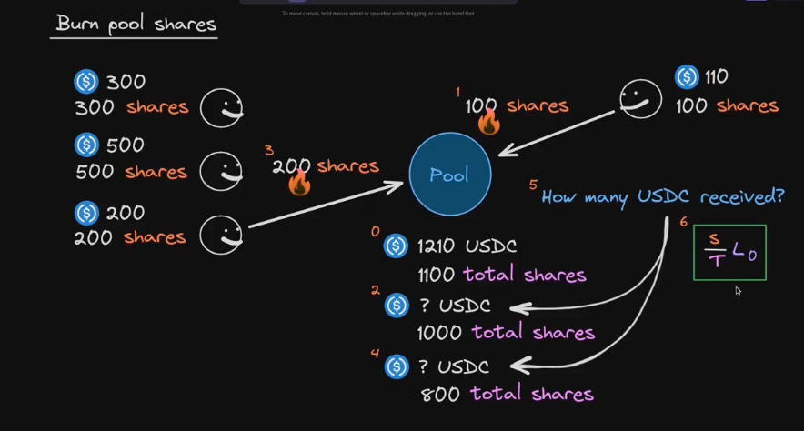


## Add liquidity


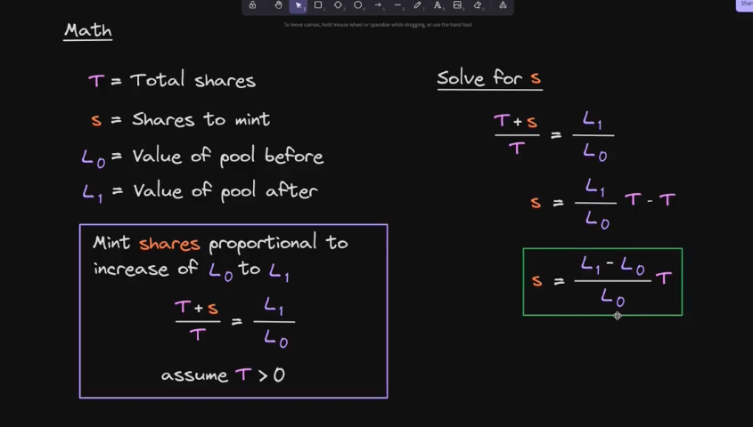
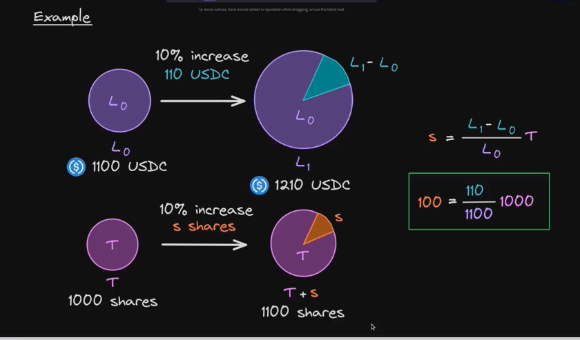


## Remove liquidity

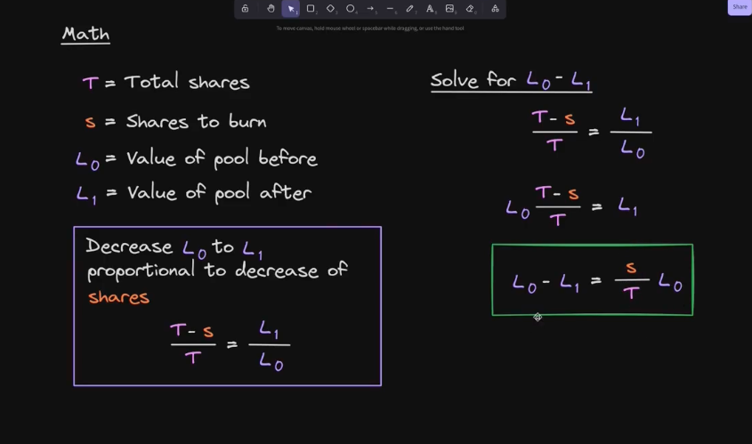
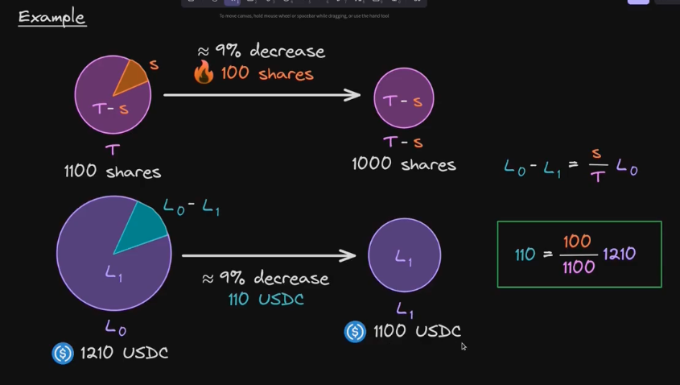

## Add Liquidity – Maintain Constant Price

When adding liquidity to a Uniswap V2 pool, we must add amounts `dx` and `dy` **in the correct ratio** so that the **price doesn't change**.


Visual Graph
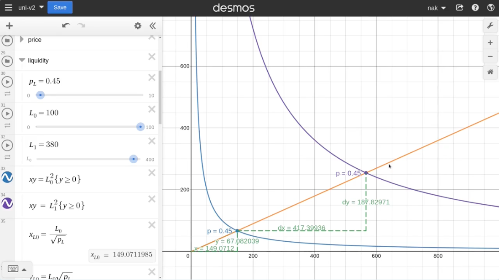

---

### 🔷 Step 1: Define the current price

The spot price before adding liquidity is:

```
price = y₀ / x₀
```

We want to **preserve this price** even after adding more tokens.

---

### 🔷 Step 2: Set up the price condition

After adding `dx` and `dy`, the new reserves become `x₀ + dx` and `y₀ + dy`.

To keep the price the same:

```
(y₀ + dy) / (x₀ + dx) = y₀ / x₀
```

---

### 🔷 Step 3: Cross-multiply and simplify

Cross-multiplying:

```
(x₀ + dx)(y₀) = (x₀)(y₀ + dy)
```

Now distribute both sides:

```
x₀ · y₀ + dx · y₀ = x₀ · y₀ + x₀ · dy
```

Subtract `x₀ · y₀` from both sides:

```
dx · y₀ = x₀ · dy
```

---

### 🔷 Step 4: Solve for dy/dx

Divide both sides by `dx · x₀`:

```
dy / dx = y₀ / x₀
```

✅ This tells you:  
To keep the price constant, the tokens must be added in the same **ratio as the current reserves**.

---

### 🟩 Final Rule:

```
dy / dx = y₀ / x₀
```

📌 This is why liquidity providers must **match the pool's current ratio** of tokens.


## Code walkthrough

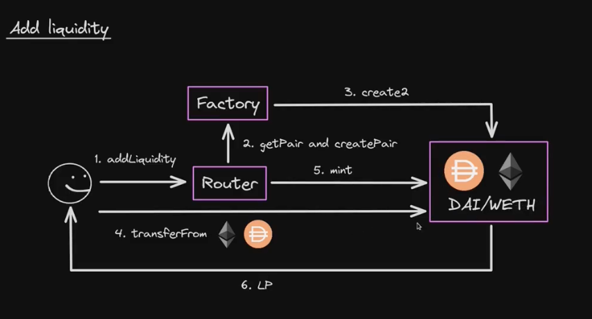

`UniswapV2Router02.sol`

```java
//NOTE: addliquidityETH to deposit ERC200+ ETH
    function addLiquidity(
        address tokenA,
        address tokenB,
        uint amountADesired,
        uint amountBDesired,
        uint amountAMin,
        uint amountBMin,
        address to,
        uint deadline
    ) external virtual override ensure(deadline) returns (uint amountA, uint amountB, uint liquidity) {
        (amountA, amountB) = _addLiquidity(tokenA, tokenB, amountADesired, amountBDesired, amountAMin, amountBMin);
        address pair = UniswapV2Library.pairFor(factory, tokenA, tokenB);
        // NOTE: transfer of tokens before mint
        TransferHelper.safeTransferFrom(tokenA, msg.sender, pair, amountA);
        TransferHelper.safeTransferFrom(tokenB, msg.sender, pair, amountB);
        liquidity = IUniswapV2Pair(pair).mint(to);
    }
```

Calling the internal add_liquidity, we are only interested in the case where reserveA and reserveB are both non-zero, otherwise it's ismple we just create the pair with the price desired

```java
    function _addLiquidity(
        address tokenA,
        address tokenB,
        uint amountADesired,
        uint amountBDesired,
        uint amountAMin,
        uint amountBMin
    ) internal virtual returns (uint amountA, uint amountB) {
        // create the pair if it doesn't exist yet
        if (IUniswapV2Factory(factory).getPair(tokenA, tokenB) == address(0)) {
            IUniswapV2Factory(factory).createPair(tokenA, tokenB);
        }
        (uint reserveA, uint reserveB) = UniswapV2Library.getReserves(factory, tokenA, tokenB);
        if (reserveA == 0 && reserveB == 0) {
            (amountA, amountB) = (amountADesired, amountBDesired);
        } else {
            uint amountBOptimal = UniswapV2Library.quote(amountADesired, reserveA, reserveB);
            // NOTE: we are in the range of deisder and amountmin
            if (amountBOptimal <= amountBDesired) {
                require(amountBOptimal >= amountBMin, 'UniswapV2Router: INSUFFICIENT_B_AMOUNT');
                (amountA, amountB) = (amountADesired, amountBOptimal);
            } else {
                uint amountAOptimal = UniswapV2Library.quote(amountBDesired, reserveB, reserveA);
                // NOTE: amountBOptimal >= amountBDesired so amountAOptimal <= amountADesired
                assert(amountAOptimal <= amountADesired);
                require(amountAOptimal >= amountAMin, 'UniswapV2Router: INSUFFICIENT_A_AMOUNT');
                (amountA, amountB) = (amountAOptimal, amountBDesired);
            }
        }
    }

```


It calls an internal Library function `quote` to calculate the optimal amount of the other token 

```java
    // given some amount of an asset and pair reserves, returns an equivalent amount of the other asset
    function quote(uint amountA, uint reserveA, uint reserveB) internal pure returns (uint amountB) {
        require(amountA > 0, 'UniswapV2Library: INSUFFICIENT_AMOUNT');
        require(reserveA > 0 && reserveB > 0, 'UniswapV2Library: INSUFFICIENT_LIQUIDITY');
        // dy = dx * y0 / x0
        amountB = amountA.mul(reserveB) / reserveA;
    }
```

Example on how to add liquidity in UniswapV2AddLiquidityTest.t.sol

When adding or removing liquidity the constant price should remain the same

### Math remove liquidity

When removing liquidity the formula is the same

```
dy/dx = yo/xo
```

When we remove liquidity we ll burn share.

s = shares to burn
T = total shares
L0 = value of the pool before removing liquidity
L1 = value of the pool after removing liquidity
L0-L1 = s/T * L0

 ((L1 - L0) / L0) = dx / x0 = dy/y0

Final equation
```
 dx = x0* s/T

 dy = y0* s/T
```

Derived from 

s/T = (L0-L1)/L0 = dx/x0 = dy/Y0

s/T = dx / x0

x0 * s/T = dx
OR 
y0 * s/T = dy 


### walkthrough remove liquidity

Check uniswap router removeLiquidity

Check the logic of burn as when removing liquidity the router send the amount of liquidity to burn from the router to the pair contract and the pair contract burn all the LP tokens in the pair as they just got sent to the pair contract.

# Flash loan

## Flah swap fees

borrow dx0
repay dx1 = dx0 + fee
x0 = reserve beforeFlash swap Fee Equation:

```
x0 - dx0 + 0.997 dx1 >= x0
```

So fee is
```
fee = 3 / 997 dx0
```

Swap dx for dy

```
amount in = dx
amount in - fee = 0.997 dx
amount = dy
```
Swap fee
`fee = 0.0003dx`

Flash swap
```
amount out = borrow dx0
amount in = repay dx1 = dx0 + fee
amount in - fee = 0.9997 dx1
```

Flash swap fee
```
fee = 0.0003 dx1
```

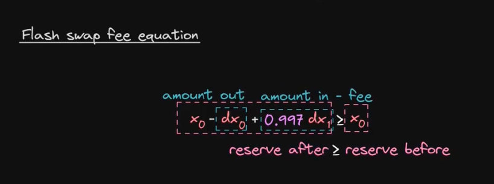

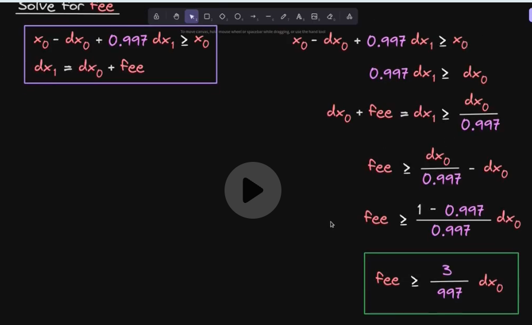

## Flash swap Code walkthrough

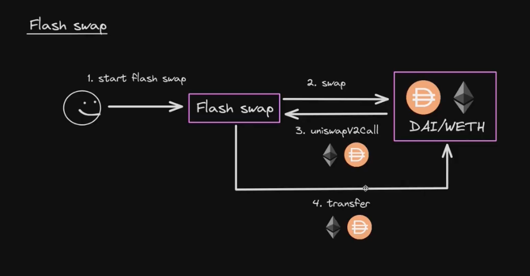

Check uniswapV2Pair for the swap function.

To trigger it we need to specified the amount to borrow, to will handle the callback we also need to have data not empty

Setup i having a contract with a `uniswapV2Call` callback

contract call the `swap` pair method with amount out and token and caller as byte data

```solidity
function flashSwap(address token, uint256 amount) external {
    require(token == token0 || token == token1, "invalid token");
    (uint256 amount0Out, uint256 amount1Out) =
    token == token0 ? (amount, uint256(0)) : (uint256(0), amount);

    // 2. Encode token and msg.sender as bytes
    bytes memory data = abi.encode(token, msg.sender);

    // 3. Call pair.swap
    pair.swap(
        amount0Out,
        amount1Out,
        address(this),
        data
    );
}
```

Then setup the callback to handle the logic:
```solidity
function uniswapV2Call(
    address sender,
    uint256 amount0,
    uint256 amount1,
    bytes calldata data
) external {

    // 1. Require msg.sender is pair contract
    require(msg.sender == address(pair), "Uniswap V2: INVALID_TO");

    // 2. Require sender is this contract
    require(sender == address(this), "Uniswap V2: INVALID_TO");

    // 3. Decode token and caller from data
    (address token, address caller) = abi.decode(data, (address, address));

    // 4. Determine amount borrowed (only one of them is > 0)
    uint256 amount = token0 == token ? amount0 : amount1;

    // 5. Calculate flash swap fee and amount to repay
    uint256 fee = (amount * 3) / 997 + 1; // 1 to round up
    uint256 amountToRepay = amount + fee;

    // 6. Get flash swap fee from caller
    // NOTE: Goal here is to have the contract making money and pay for the fee for the demo we have the user paying for fees
    IERC20(token).transferFrom(caller, address(this), fee);
    IERC20(token).transfer(address(pair), amountToRepay);
}
```

# TWAP

## Spot price oracle

Twap - time weighted average price

Pi = Price Of token X in terms of then Y
between time ti <= t <= ti+1

Delta of ti = ti+1 -ti

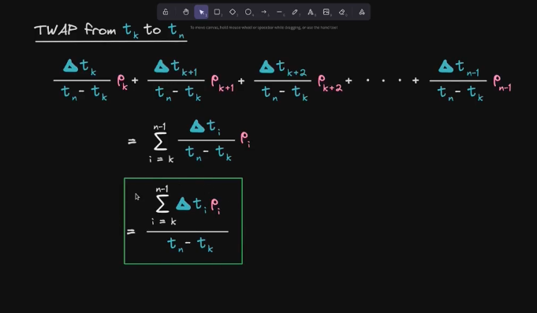

In a contract we ll need cumulative Price instead of using a for loop

                                  j-1
cj = cumulative price up to tj = E(Pi * Delta ti)
                                  i=0

Twap for tk to tn = cn - ck / tn - tk

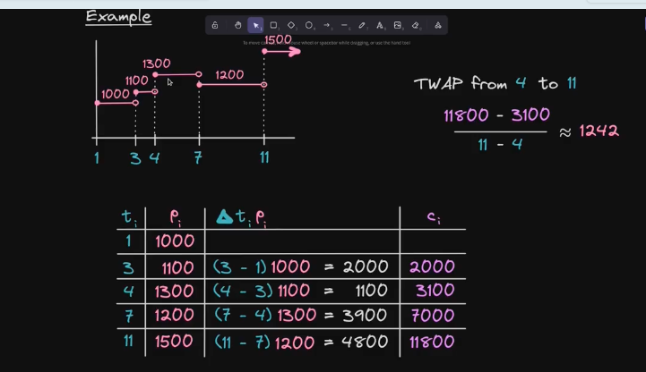

key operation are done here:

```solidity
        if (timeElapsed > 0 && _reserve0 != 0 && _reserve1 != 0) {
            // NOTE: TWAP - Time weighted average pricing
            // * never overflows, and + overflow is desired
            price0CumulativeLast += uint(UQ112x112.encode(_reserve1).uqdiv(_reserve0)) * timeElapsed;
            price1CumulativeLast += uint(UQ112x112.encode(_reserve0).uqdiv(_reserve1)) * timeElapsed;
        }
```

overflow is ok because we are calculating the diff between current cumulative price and last cumulative price

check UniswapV2Twap.t.sol example


# Arbitrage

check src/UniswapV2Arb1.sol and src/UniswapV2Arb2.t.sol for arbitrage example using uniswap router or uniswap pair contract


## Arbitrage optimal amount in

Arbitrage profit function is

f(dyA) = dyB - dyA

dyA* = Amount in that maximizes F

dyA* = (-b + sqrt(b^2 + 4ac)) / 2a

Where
a = k^2
b = 2 \* k \* x\_a \* y\_b
c = (y\_a \* x\_b) + ( (1 - f) \* x\_b + (1 - f)^2 \* x\_a )^2


f = swap fee 0 <= f <= 1
xA = AMM A reserve out
yA = AMM A reserve in
xB = AMM B reserve in
yB = AMM B reserve out

## Math

swap amount out = Aout = (A in (1 -f )Rout) / (Rin + A in (1 -f ))

Ain = amount in
Rin = reserve in
R out = reserve out
