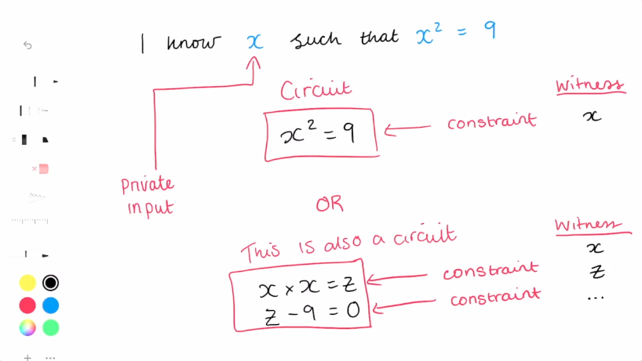

# ZKP

## Base

There is 2 entities iimportant in ZKP.

The proover and the verifier.

The proover is able to proove that he know a solution without revealing it.

There is 3 important notion for this:

Completness:
If the statement is true an honest prover must be able to convince the verifier

Soundness:
If the statement is false no dishonest prover can convince an honest verifier

Zero knowledge:
The verifier must learn nothing except that the prover's statement is true

- What is one of the advantages that Zero-Knowledge Proofs provide within the domain of blockchain systems?

Enabling enhanced privacy for transactions or data.

- What is the primary characteristic of a Zero-Knowledge Proof (ZKP)?

It allows a prover to demonstrate knowledge of a secret to a verifier without revealing the secret itself.

- Which of the following is a fundamental property that a Zero-Knowledge Proof protocol must satisfy?

Soundness

- In the context of blockchain technology, what is a key benefit of using Zero-Knowledge Proofs in ZK-Rollups?

Improving scalability by bundling transactions and verifying them with a single proof.

- In a Zero-Knowledge Proof interaction, what are the roles of the two primary parties involved?

A Prover, who aims to prove knowledge, and a Verifier, who checks the proof satisfies the requirements.

- How can Zero-Knowledge Proofs be applied to enhance privacy in an age verification scenario?

By allowing an individual to prove they meet an age requirement without revealing their exact date of birth or other personal details.

- What is a Zero-Knowledge Proof (ZKP)?

A cryptographic method that allows a Prover to demonstrate knowledge of specific information to a Verifier without revealing the information itself.

- Which of the following best describes a key characteristic of interactive Zero-Knowledge Proofs?

They require multiple rounds of communication and responses between the Prover and the Verifier.

- What is a primary advantage of Non-Interactive Zero-Knowledge Proofs (NIZKs) that makes them suitable for blockchain systems?

A single proof can be generated and then verified by anyone without further interaction, enabling public verifiability.

- SNARKs and STARKs are two prominent types of what kind of cryptographic proof system?

Non-Interactive Zero-Knowledge Proofs (NIZKs).

- In the context of blockchain technology, what is a significant application of Non-Interactive Zero-Knowledge Proofs like SNARKs or STARKs?

Enabling verifiable computation to improve blockchain scalability, such as in ZK-Rollups.

-  In the context of Zero-Knowledge Proofs, what fundamental role does a 'claim' or 'statement' fulfill?

It is an assertion of a property's truthfulness that a prover aims to demonstrate without revealing underlying secret information.

- Within a Zero-Knowledge Proof system, what is the principal difference between 'private inputs' and 'public inputs'?

Private inputs are known exclusively to the prover, whereas public inputs are accessible to both the prover and the verifier.

- What is the function of 'constraints' in the design and operation of Zero-Knowledge Proofs?

They specify the set of mathematical conditions or equations that must be satisfied by the inputs for the prover's claim to be considered valid.

- How is a 'circuit' defined in the domain of Zero-Knowledge Proofs?

It is a comprehensive system or collection of all constraints that, when collectively satisfied, confirm the validity of the prover's overall claim.

- What does the 'witness' primarily consist of in a Zero-Knowledge Proof system?

The set of secret values which enables a prover to demonstrate that their claim satisfies all defined constraints.

- What is the primary security implication if the initial secret value (τ) used in a ZK-SNARK trusted setup ceremony is not irretrievably destroyed?

It would allow malicious actors to forge invalid proofs that appear legitimate.

- In the context of ZK-SNARK trusted setups, what does 'toxic waste' primarily refer to?

The original secret random values (e.g., τ) that must be destroyed after generating public parameters.

- What is the fundamental security guarantee provided by using Multi-Party Computation (MPC) in a trusted setup for ZKPs?

The overall secret (τ) remains secure and unrecoverable as long as at least one participant acts honestly and destroys their secret contribution.

-  A 'Powers of Tau' ceremony generates a Structured Reference String (SRS) often composed of terms like *G, τ·G, τ²·G, ..., τᵏ·G*. What is the most critical security requirement concerning 'τ' in this SRS?

The underlying secret value 'τ' must be irretrievably destroyed after the SRS is generated.

- PLONK proofs are known for using universal trusted setups. What is a primary benefit of a universal setup compared to a circuit-specific setup like the one required by Groth16's Phase 2?

A single generated SRS can be used for proofs across many different programs or circuits, up to a certain complexity.

- In a scenario involving a "Proof of Computation," what is the primary aspect being verified?

That a specific computational process was executed correctly according to a predefined set of rules or constraints.

- What is the central aim of a Zero-Knowledge Proof of Knowledge (ZKPoK)?

To prove possession of specific secret information (a witness) without revealing the information itself.

- What is the primary objective of a Zero-Knowledge Proof of Computation (ZKPoC)?

To demonstrate that a specific computation was performed correctly according to predefined rules and constraints.

- How does a Zero-Knowledge Proof of Computation (ZKPoC) typically relate to a Zero-Knowledge Proof of Knowledge (ZKPoK)?

A ZKPoC implies a ZKPoK of the private inputs used in the verified computation.

- In the context of Zero-Knowledge Proofs, what is the function of an "arithmetic circuit"?

To provide a formal, mathematical representation of the computation whose correctness is being proven.

## Type of ZK

### Interactive ZK Proof

Back an forth between the proover and verifier.

Repeat challenge / response untill Verifier is convinced, there is multiple round of verification they are really time consuming, need to maintain the state untill multiple round.

### Non-interactive ZK Proof

Only one round of verification, the prover send only one message to the verifier.

## ZK terminology

### Claim /statement

Is an assertion that something is true. in the context of zero-knowledge proofs (ZKPs) it referes to the property being proven without revealing additional information

It is the "claim" the prover is making about the "witness".

"I know x such tht x^2=9"

"i am over the minimum ager" So i can enter the club

### Private and public inputs

- Private inputs are inputs to the system which are only known to the prover and not the verifier (the witness)

X in the example of the private input
age in the example of the private input

- Public inputs known to both the prover and the verifier

Minimum age is the public input

- Constaint , mathematical condition which must be satisfied in order for the claim to be valid
Constraints define the rules the inputs must follow.

assert that `x2=9` is the constraint

OR

`x*x = Z` is the constraint
`Z - 9 = 0` is the constraint

In the above example my_age >= min_age is the constraint

### Circuit

A system of constraints makes up the circuit

A series of mathematical relations and operations

The circuit defines how the constraints work together

we could have only one constraint in a circuit or multiples constraint that will make the circuit

### Witness

The set of private values that allow a prover to demonstrate that their claim or statement is valid/true

Include the private inputs but also can include intermediate calculations

The witness must satisfy the constraints of the circuit

### Proover and verifier

The prover is the entity that generates the proof of computation to demonstrate knowledge of the witness while satisfying the circuit constraints

The verifier is the entity that checks wheter the proof is valid, by running a verification algo

### Trusted setup

This is a crutial step in Snark (GROTH16 , PLONK).

A trusted steup ceremony is a procedure that is done once to generate some data that must be used everytime some cryptographic (ZK in this instance) protocol is run.

1- create a secret 
2- transform the secret into cryptographic data
3- discard secret
4- create proofs using the data made from secret

### Toxic wast

During trusted setup if value are leak attacker can forge invalide proofs that will pass verification, those value should be securly destroyed

### Common reference String CRS

Common reference String is a set of public parameters taht both the prover and verifier use in the proof generation and verification processes.

This is the cryptographic parameter created during the trusted setup

### Structured reference String SRS

Structured reference String, eg eliptic curve proof

You can generate a Final secret Tau (toxic waste) the srs will be specific points on the eleptic curve

### Multi party computation MPC

Used in the lot of instance but using in ZKP where multiple party contribute to create a parameter.

Security enhancing process.

In TAU each participant receive the current parameter contribute a bit of randomness and pass the parameter they then destroy there contribution.

The security come from each participant to keep their secret.

### Power of Tau

Is a serie of eliptic curve point that are created by some secret time the generation point

### Polynomial Commitment

A trusted setup can also include a polynomial Commitment which is a cryptographic method that allow you to commit to a specific polynomial and keep the coeficient secret , that will be used to proof later.

eg: KZG commitment (this is the polynomial that i ll be using)

### Trusted Setup example

Circuit specific: The cryptographic parameters need to be regenerated for every circuit

Universal: The cryptographic parameters can be reused (for circuite up to a certain size)

### GROTH16 is an example where the setup need to be circuit specific

#### Phase 1: Powers of Tau

Generates a general purpose SRS for circuit of a certain size.

This step is not circuit-specific and can be reused

This is where the structured reference string (SRS) containing the encoded powers or T as elleptic curve point is generated

These are the gT, GT^2 etc element

#### Phase 2: Circuit specific

The power of tau are combined with the circuit's constraints to produce an extended SRS (with it's own toxic waste)

This generate A proving Key and a Verification Key

### PLONK is an example of an universal setup

Universal and updatable SRS

Multiple circuits can share the same setup as long as they fit within a size constraint

#### PLONK SETUP

The power of tau process generates the SRS which is then used for polynomial commitments.

PLONK commonly uses the KZG commitment scheme where polynomials are committed using the powers of Tau and evaluated at a specific challenge point.

### Proof of computation vs Proof of knowledge

ZKP aren't always used for proof of knowledge but sometime used for proof of computation.

Proof of computation immplies Proof of knowledge of the private inputs.

## ZKP Requirements

1- completeness if the statement is valid a prover must always be able to convince a verifier if they have knowledge of the witness.

Comon bug case where the code with a valid input doesn't pass a verification

2 - Soundness it must be practically impossible for a dishonest prover to convince an honest verifier with an invalid witness

if a prover doesn't know the proof it should be impossible to trick the verifier

3- Zero knowledge the verifier should know absolutly nothing about the provers knowledge of a witness to the statement.

Carefull of not leaking the input data

## ZK In practice

Where to use in FE and BE

FE - the frontend is the constraint system (circuit) it's where the problem is defined mathematically (NOIR)

BE - it takes your circuit and generate a proof

- Proving system
- Takes the compiled circuits and create the proof
- Verifies the proof (or can create a verifier contract for on-chain vertification)

Steps

FE

Arithmetization & constraint system

Break down a problem into mathematical form mean trnasform a problem into a circuit:

Claim "i am over 18 and can enter the club" -> require(age >= min_age)

Written in a domain specific language like NOIR

It's compile into a ACIR or R1CS.

Then the prover generate a witness

BE

Proof of generation

Take the ACIR and create a Proof of execution

Then Verification, the verifier check the proof against the Constraints can be done off-chain (script) or onchain (using a verifier smart contract usually generated using a cli tool like barrentbeg for Noir programs)

## ZK Application

Wide range of privacy application.

Private KYC or application.

Can solve 2 major problem:

scalability and privacy

i don't want to reveile my wallet balance

### ZK Rollups

Used to verify state changes, ZK era use ZK proof.

Transaction are batch off-chain and submited to L1 for verification.
Decrease gas fees, information are still transparent.

can be refered are succunts Rollups where data are not private.

### Private Application

To keep information secret like tornado cash, Private airdrop, private voting ect

Id verification, like polygon ID with onchain KYC.

ZK L1s: ZCash, user can choose between transparent and shield trnasaction

Proof of web2 data onchain, Chainlink deco

#### Final

- Which property of a zero-knowledge proof system is violated if the verifier incorrectly rejects a valid proof provided by an honest prover who knows a valid witness and follows the protocol correctly?

Completeness

- In a Zero-Knowledge Proof system, which property ensures that if a statement is true and the prover is honest and follows the protocol, they will always be able to convince the verifier?

Completeness

- What fundamental property of a Zero-Knowledge Proof system prevents a dishonest prover from successfully deceiving a verifier with a false statement or an invalid witness?

Soundness

- Which defining characteristic of a Zero-Knowledge Proof system dictates that the verifier gains no information about the prover's secret inputs and witness other than the truth of the statement being proven?

Zero-Knowledge

-  If a ZKP-based age verification system allows an underage individual to successfully prove they meet an age requirement by exploiting a flaw in the system's logic, which core ZKP property has been compromised?

Soundness

- Development tools such as Circom and Noir are primarily used in the ZKP ecosystem for what purpose?

To facilitate the creation of arithmetic circuits that define the statements to be proven in ZKPs.

-  What is the significance of an Intermediate Representation (IR) like ACIR (Abstract Circuit Intermediate Representation) in ZKP systems?

It serves as a standardized bridge between different front-end circuit languages and back-end proving systems.

- What is the primary advantage of using Domain Specific Languages (DSLs) like Noir or Circom when developing Zero-Knowledge Proofs?

They simplify circuit creation by abstracting complex mathematical details.

-  Which type of Zero-Knowledge Proof allows a prover to generate a proof that can be verified by anyone at any time, without requiring additional rounds of interaction?

Non-interactive ZKPs (NIZKs)

- Which fundamental property of a Zero-Knowledge Proof ensures that if a statement is true and both the prover and verifier are honest, the verifier will be convinced of the statement's truth?

Completeness

- When creating a Zero-Knowledge Proof, computational problems are converted into arithmetic or boolean circuits. What are the name of the rules or equations in these circuits that must be satisfied?

Constraints

